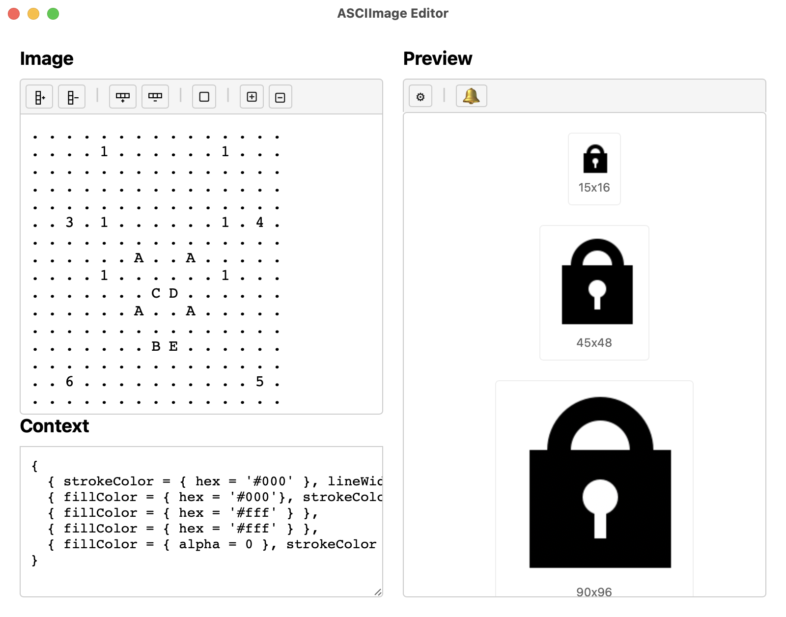

# ASCIImage Editor Spoon

A Hammerspoon spoon that provides an editor for the ASCIImage format, which
allows creating images using ASCII art using the
[`hs.image.imageFromASCII`](https://www.hammerspoon.org/docs/hs.image.html#imageFromASCII)
function which is based on the [ASCIImage](https://github.com/cparnot/ASCIImage) library.

## Features

* Live preview in different sizes
* Preview of menubar icon
* Preview of notification image

## Screenshot



See the [tricky example](http://cocoamine.net/blog/2015/03/20/replacing-photoshop-with-nsstring/#:~:text=Here%20is%20how%20the%20string%20is%20parsed%2C%20shape%20after%20shape%2C%20layer%20after%20layer:)
from the [original blog post](http://cocoamine.net/blog/2015/03/20/replacing-photoshop-with-nsstring/)
for explanation of how the image is created.

## Installation

1. Clone this repository to your Hammerspoon spoons directory:
```bash
cd ~/.hammerspoon/Spoons
git clone https://github.com/fbenkstein/ASCIImageEditor.spoon.git
```

2. Load the spoon in your Hammerspoon configuration:
```lua
hs.loadSpoon("ASCIImageEditor")
```

## Usage

```lua
-- Show the ASCIImage editor
spoon.ASCIImageEditor:show()
```

## License

MIT License 
